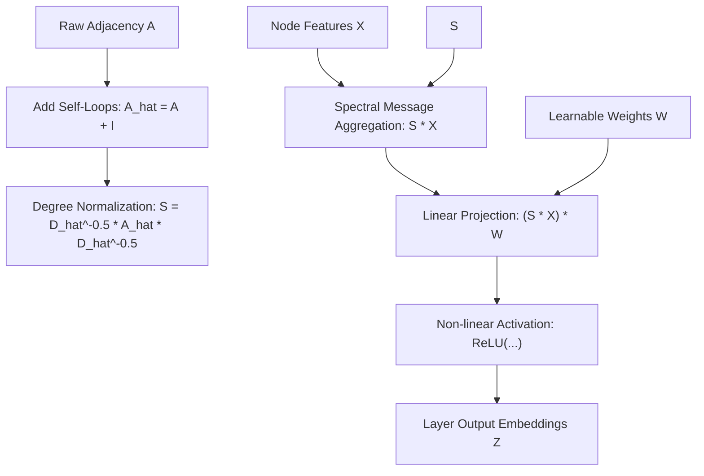

# genpark-graph-convolutional-network-gcn-layer-skill

Agent Skill implementing **Spectral Graph Convolutional Network (GCN)** with Kipf & Welling self-loop renormalization and localized spatial feature aggregation.

## Architectural Overview

